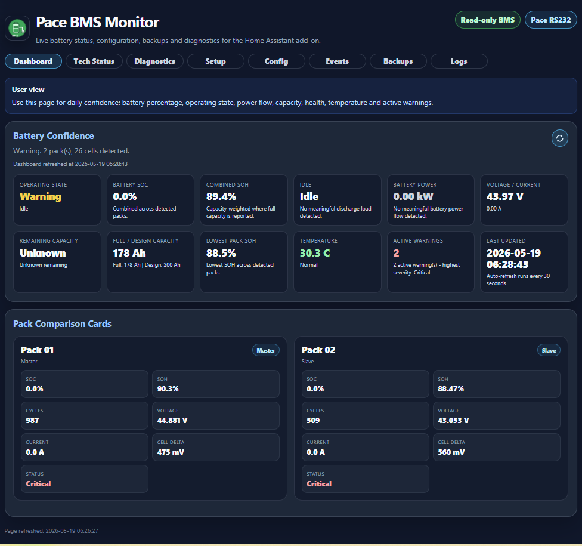
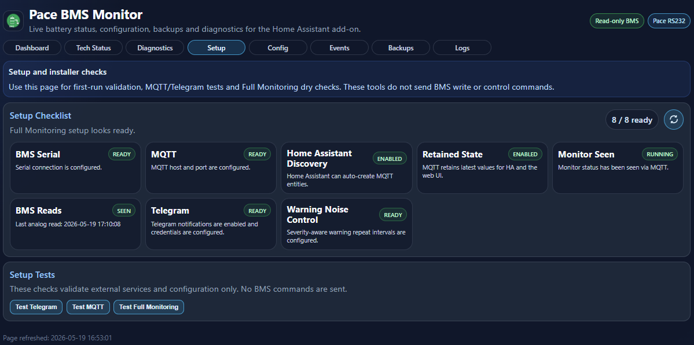
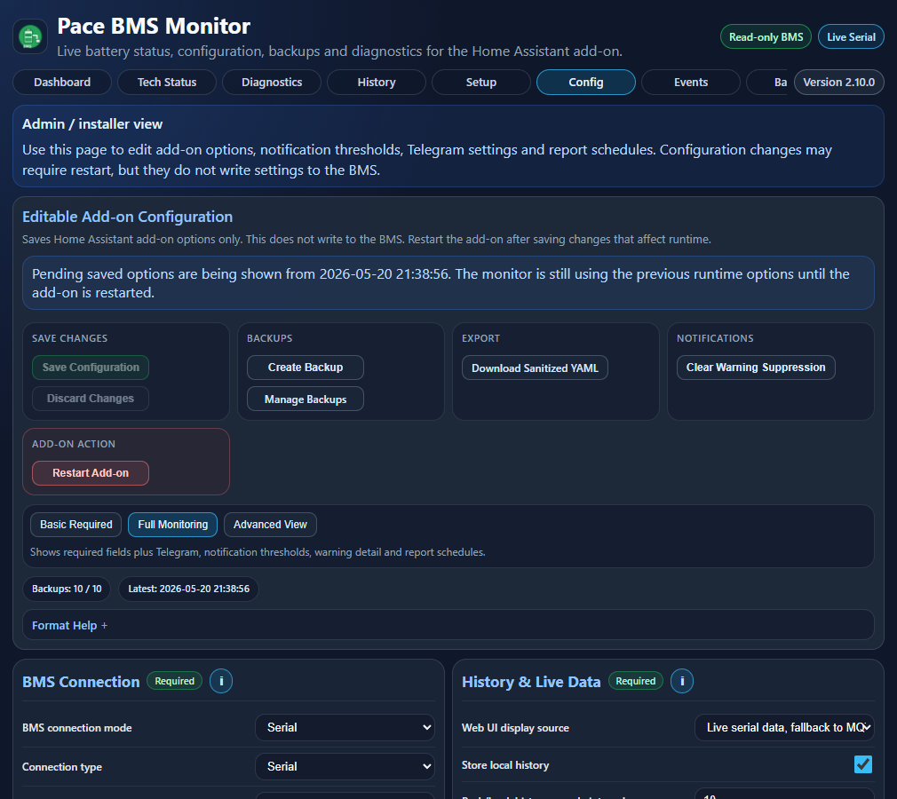
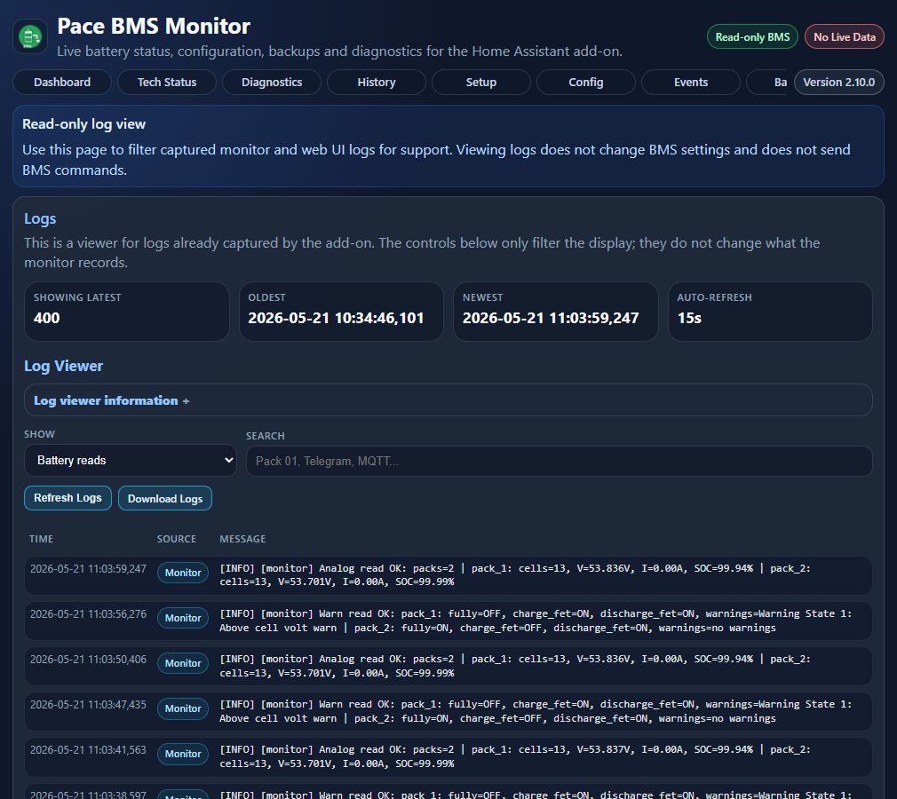
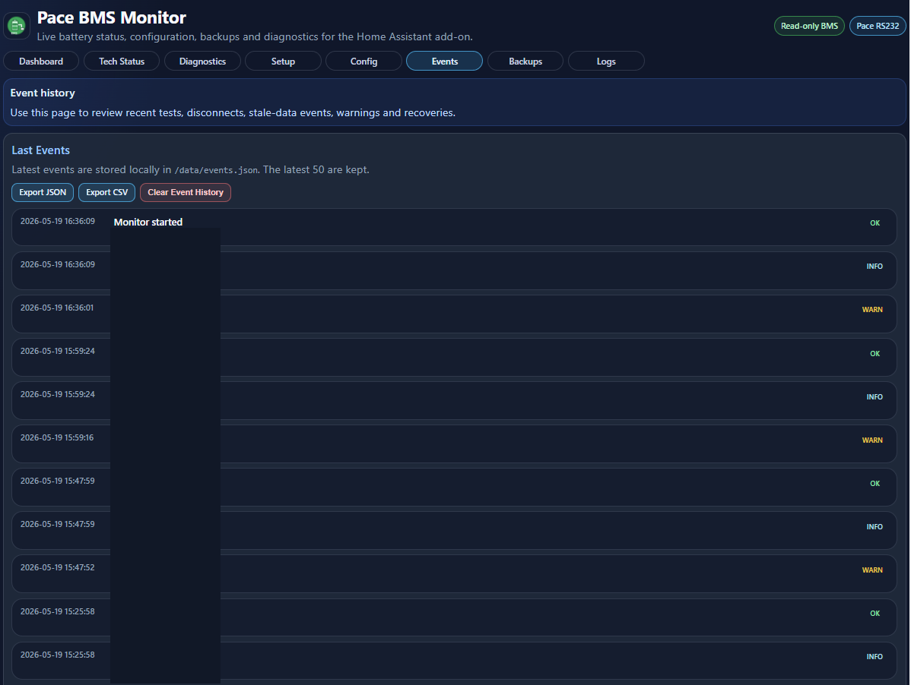
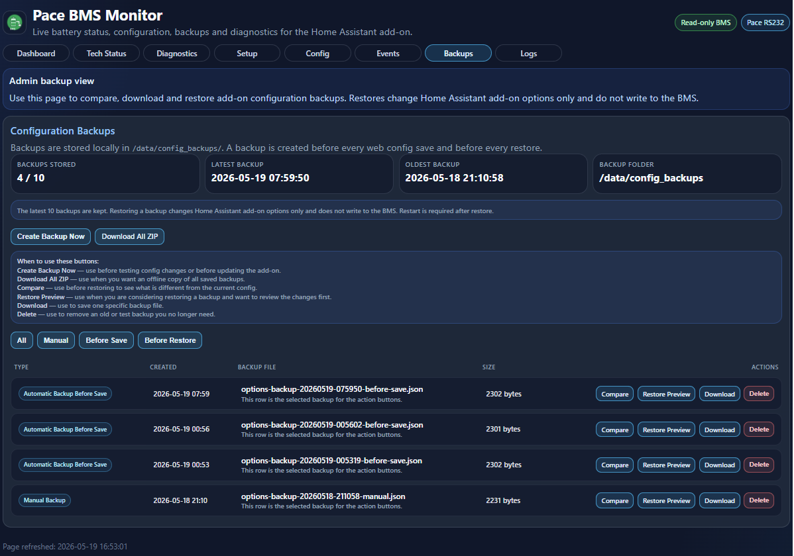
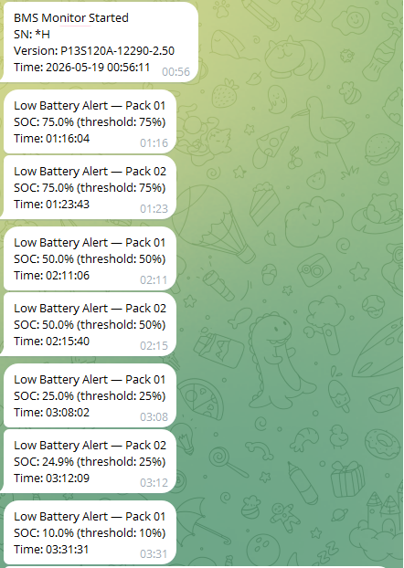
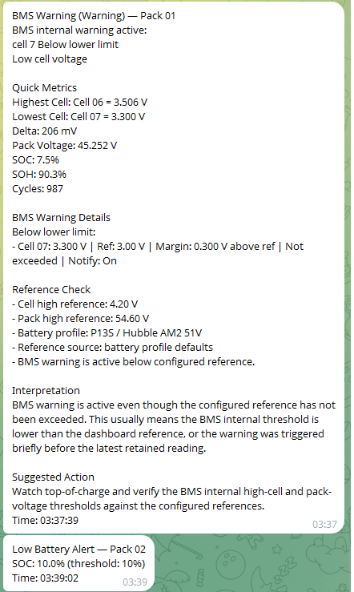
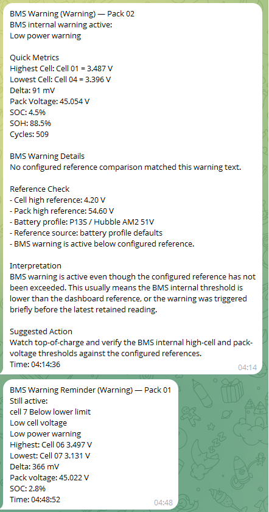
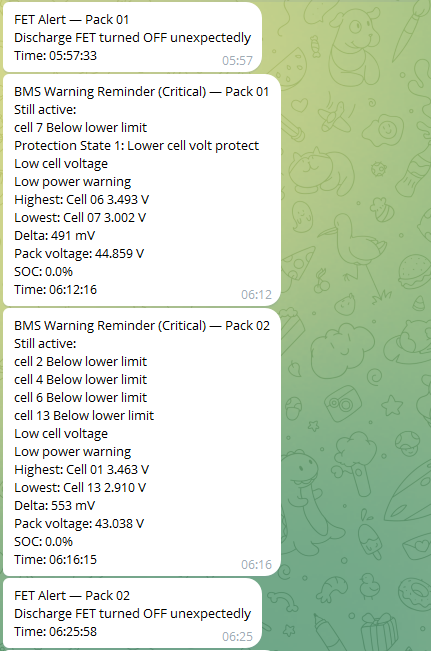

# PaceBMS - Pace BMS Serial Monitor

A Python-based read-only monitor for **Pace-compatible BMS batteries**. It reads battery data over the **Pace BMS RS232 / UART ASCII protocol**, writes a local live snapshot for the web UI, stores local SQLite history for graphs, and can optionally publish MQTT/Home Assistant entities.

This project is designed for batteries using a Pace-compatible BMS protocol. It is **not limited to Hubble AM2**. Hubble AM2 is one tested example.

The add-on includes:

- Serial-first live web UI
- Local SQLite history and compact graphs
- Optional Home Assistant MQTT Discovery
- Direct Telegram notifications
- Home Assistant Ingress web UI
- Live serial status page with MQTT fallback when enabled
- Test Telegram and Test MQTT buttons
- Auto cell-count detection
- Auto multi-pack detection
- Stale-data monitoring
- Combined user dashboard summary
- Battery power flow
- Remaining Ah and estimated remaining kWh
- Estimated runtime remaining while discharging
- Estimated charge time remaining while charging
- Profile-based BMS warning Telegram filtering
- Local vendored Chart.js graphs; no CDN required at runtime
- Read-only BMS communication

---

## Current Version

```yaml
version: "2.9.0"
```

---

## Read-Only Safety

This monitor is intended to be **read-only**.

It sends only Pace BMS read requests such as:

- BMS version
- BMS serial number
- Analog pack data
- Pack capacity
- Warning/status information

It does **not** write settings to the BMS.

It does **not** change protection thresholds.

It does **not** enable or disable charge/discharge FETs.

It does **not** send control commands to the battery.

All configurable thresholds in this project are used only for **notification detail and display reference**. They do not configure the BMS.

---

## Maintainer / Agent Guidance

Project-specific guidance for future AI-assisted maintenance is kept in [`AGENTS.md`](AGENTS.md) and [`docs/ai/`](docs/ai/). These files document the read-only safety rules, sprint workflow, config rules, alert rules, UI rules and validation checklist used for this add-on.

---

## Supported Batteries

This project should work with batteries that expose the **Pace BMS RS232 / UART ASCII protocol**.

Tested examples:

| BMS / firmware string | Battery | Connection | Notes |
|---|---|---:|---|
| `P13S120A-12290-1.50` | Hubble Lithium AM2 5.5kWh 51V Battery | RS232 | 13 cells in series |
| `P13S120A-12290-2.50` | Hubble Lithium AM2 5.5kWh 51V Battery | RS232 | 13 cells in series |
| `P16S200A-C21084-3.10` | Eenovance Mana LFP Wall Mount 10.65kWh 51.2V | RS232 | 16 cells in series |

The protocol is used by multiple battery brands and models. Battery behaviour, warning thresholds, and reported status bits may vary between manufacturers.

### How to read the model numbers

`P13S120A-12290-1.50`

| Part | Meaning |
|---|---|
| `P` | Pace BMS / Pace firmware family |
| `13S` | 13 cells in series, for example Hubble Lithium AM2 5.5kWh 51V Battery |
| `120A` | 120A current class |
| `12290` | Hardware / customer / firmware branch identifier |
| `1.50` | Firmware version / firmware revision |

`P16S200A-C21084-3.10`

| Part | Meaning |
|---|---|
| `P` | Pace BMS / Pace firmware family |
| `16S` | 16 cells in series, for example Eenovance Mana LFP Wall Mount 10.65kWh 51.2V |
| `200A` | 200A current class |
| `C21084` | Hardware / customer / firmware branch identifier |
| `3.10` | Firmware version / revision |

The Battery Profile setting uses these cell-count families only for read-only UI and Telegram reference checks. It does not write thresholds to the BMS.

---

## Auto Cell and Pack Detection

The monitor does **not** assume a fixed 16-cell battery.

The BMS response reports the cell count, and the monitor publishes only the cells returned by the BMS.

Examples:

| Battery layout | Published cells |
|---|---:|
| 13-cell Pace/Hubble-style pack | `cell_01` to `cell_13` |
| 16-cell standard lithium pack | `cell_01` to `cell_16` |

The monitor also detects additional packs when the batteries are linked correctly and each pack has the correct DIP switch address.

### Multi-Pack Requirements

For additional packs to appear:

- Batteries must be linked using the manufacturer’s battery-link cable setup.
- Each pack must have a unique DIP switch address.
- The master battery must be connected to the monitor using the supported RS232/Pace port.
- The master BMS must report the linked packs in the Pace protocol response.

`zero_pad_number_packs` and `zero_pad_number_cells` only change MQTT topic naming. They do not affect pack or cell detection.

---

## Hubble AM2 Notes

For Hubble AM2-style systems:

- Use the **RS232 port** for this project.
- The RS232 port uses the Pace BMS ASCII protocol.
- The RS485 port is not used by this project.
- The RS485/Modbus port is a different protocol and is not handled by this monitor.
- Multiple batteries should be linked using the normal battery-link method.
- DIP switches must be configured so each battery has the correct address.

Common address pattern:

| Address | Use |
|---:|---|
| 0 | Independent / single battery use, depending on battery manual |
| 1 | Master / main battery |
| 2+ | Slave / additional batteries |

Always confirm DIP settings against the battery manufacturer’s manual.

---

## Features

### Battery Data

The monitor reads and publishes:

- Pack voltage
- Pack current
- State of charge
- State of health
- Remaining capacity
- Full capacity
- Design capacity
- Cycles
- Individual cell voltages
- Temperatures
- Cell voltage delta
- Warning/status states
- FET states
- Protection states
- Balancing states

### MQTT

- MQTT state publishing
- MQTT retained state support
- MQTT Last Will and Testament availability
- Home Assistant MQTT Discovery
- Home Assistant Supervisor watchdog health check
- Forced republish interval for state and warning topics
- Retained BMS identity topics:
  - `pacebms/bms_version`
  - `pacebms/bms_sn`
  - `pacebms/pack_sn`

### Telegram Notifications

Direct Telegram notifications are sent from Python. Home Assistant automations are not required.

Supported alerts:

- Monitor started
- Monitor stopped
- BMS disconnected
- BMS reconnected
- SOC low thresholds
- SOC high / fully charged
- SOH threshold
- BMS warning
- BMS warning cleared
- FET alerts
- Daily summary
- Cell delta report
- Stale-data alert
- Stale-data recovery alert

### Home Assistant Ingress Web UI

The add-on includes a read-only web UI inside Home Assistant.

The web UI includes:

- Configuration overview
- Basic Required / Full Monitoring / Advanced configuration views
- Battery Confidence dashboard with SOC, combined SOH, power flow, runtime/charge-time estimate, capacity, health, warning summary and compact refresh
- Tech Status with warning intelligence, quick metrics, reference margins, grouped per-pack identity, energy, capacity, electrical, cell balance, reference, FET state and comparison charts
- Detected packs
- Pack SOC / SOH
- Pack cycles
- Pack voltage / current
- Cell delta
- FET status
- Warning status
- BMS serial number
- Last analog read timestamp
- Last warning read timestamp
- Stale-data status
- Caution / Warning / Critical warning severity context
- Test Telegram button
- Test MQTT button

The web UI is **read-only to the BMS**.

The test buttons only test external services:

- Test Telegram sends a Telegram test message.
- Test MQTT checks broker connectivity.
- Test Full Monitoring checks enabled integrations, Telegram configuration and notification thresholds without sending a Telegram message.

### Runtime and Charge-Time Estimates

The User Dashboard time tile changes with battery direction:

- **Runtime Estimate** appears while the battery is discharging.
- **Charge Time Estimate** appears while the battery is charging.
- **Idle** appears when no meaningful charge or discharge power is detected.

Runtime is calculated from current remaining energy divided by current discharge power.
Charge time is calculated from the energy needed to reach reported full capacity divided by current charge power.

These values are estimates from the latest live serial snapshot, with retained MQTT used only as fallback when configured and fresh. They will change as load or charge current changes, and charge time may increase near full SOC when charge current tapers.

---

## Web UI Screenshots

The first screen for daily use is the **Dashboard** tab. The screenshots below show the current Classic UI user, technician, setup, configuration, support and alerting views.

### Dashboard

Use this for daily battery confidence: operating state, SOC, combined SOH, power flow, runtime/charge-time estimate, voltage/current, capacity, temperature and active warnings.



### Tech Status

Use this for technician review: overall monitor state, warning intelligence, per-pack values, reference margins, FET state and comparison charts.


### Setup

Use this for first-run checks and safe external service testing. The Full Monitoring test checks MQTT and Telegram configuration without sending BMS commands.



### Config

Use Config to edit Home Assistant add-on options. The tab is grouped into required connection settings, Telegram/notification options, alert references, warning detail and report schedules. These settings are saved to the add-on only; they are not written to the BMS.




### Diagnostics

Use Diagnostics for support proof, battery identity, health checks and detailed cell data.


### Logs, Events and Backups

Logs are a read-only support view. Events show app-level history. Backups manage local add-on configuration backups.







### Telegram Examples

Telegram screenshots show the type of alert/report content the add-on can send when notifications are enabled.









For setup/support screenshots, capture the audience-specific tabs:

- **Dashboard**: normal user view with combined battery confidence values.
- **Tech Status**: live per-pack values, warning intelligence, comparison charts and reference checks.
- **Setup**: first-run checklist and MQTT/Telegram/Full Monitoring tests.
- **Diagnostics**: support proof, battery identity and detailed cell data.

Recommended screenshots to include when asking for support:

- Home Assistant add-on Configuration tab.
- Pace BMS Dashboard tab showing the User Dashboard.
- Pace BMS Tech Status tab showing Warning Intelligence, pack details and comparison charts.
- Pace BMS Setup tab showing Setup Checklist.
- Test Full Monitoring result message.
- Example Telegram alert if notifications are enabled.

Do not share screenshots that expose the full Telegram bot token, Telegram chat ID or MQTT password.

Screenshot naming and privacy guidance is kept in [`docs/screenshots/README.md`](docs/screenshots/README.md). The repository may include example screenshots over time, but users should always hide secrets before sharing images publicly.

---

## Home Assistant Add-on Installation

1. Open Home Assistant.
2. Go to **Settings → Add-ons → Add-on Store**.
3. Click the three-dot menu.
4. Select **Repositories**.
5. Add this repository:

```text
https://github.com/saratrax13-sketch/serial_rs232_pacebms
```

6. Install the add-on.
7. Configure the add-on.
8. Start the add-on.

---

## Standalone Docker Mode

Home Assistant add-on mode remains the primary deployment path, but the project can also run as a standalone Docker container.

Standalone Docker uses the same read-only monitor and the same `/data/options.json` runtime configuration file. On first start, `standalone_config.py` creates `/data/options.json` from `config.yaml` defaults plus `PACEBMS_` environment variables. Existing `/data/options.json` files are never overwritten.

Basic standalone flow:

```powershell
copy .env.example .env
docker compose up -d --build
```

Then open:

```text
http://localhost:8099
```

Minimum `.env` values to review:

- `PACEBMS_SERIAL_DEVICE`
- `PACEBMS_MQTT_ENABLED`
- `PACEBMS_UI_DATA_SOURCE`
- `PACEBMS_METRICS_ENABLED`
- `PACEBMS_HISTORY_SAMPLE_SECONDS`
- `PACEBMS_HISTORY_CELL_SAMPLE_SECONDS`
- `PACEBMS_MQTT_HOST`, `PACEBMS_MQTT_USER`, `PACEBMS_MQTT_PASSWORD` only when MQTT is enabled
- `PACEBMS_TELEGRAM_BOT_TOKEN`
- `PACEBMS_TELEGRAM_CHAT_ID`

Standalone Docker stores runtime files in `./data`, which is ignored by Git.

Full standalone instructions are in [`docs/STANDALONE_DOCKER.md`](docs/STANDALONE_DOCKER.md).

Safety is unchanged: standalone Docker does not add BMS write/control commands, does not control FETs and does not write BMS thresholds.

---

## First-Run Setup Checklist

After starting the add-on, open the **Pace BMS** web UI from the Home Assistant sidebar.

The **Setup** tab includes a **Setup Checklist** card. Use it as the guided first-run check:

- **BMS Serial** should show that the USB/serial path is configured.
- **MQTT** should show disabled when serial-only monitoring is intended, or show broker host and port when MQTT is enabled.
- **Home Assistant Discovery** should be enabled if you want sensors created automatically.
- **Retained State** should be enabled so the web UI and Home Assistant recover values after reconnects.
- **Monitor Seen** confirms live monitor status has appeared through the current data source.
- **BMS Reads** confirms a successful analog read was seen.
- **Telegram** confirms direct notification values are configured.
- **Warning Noise Control** confirms severity-aware repeat intervals are valid.

Use the buttons on the Setup tab:

- **Test MQTT** checks broker connectivity only.
- **Test Telegram** sends a Telegram test message.
- **Test Full Monitoring** checks enabled integrations, Telegram configuration and notification thresholds without sending a Telegram message and without sending any BMS commands.

If Telegram still contains placeholder values such as `YOUR_TELEGRAM_BOT_TOKEN` or `YOUR_TELEGRAM_CHAT_ID`, the checklist shows a warning and direct Telegram alerts will be skipped.

The **Tech Status** tab focuses on technician review after the add-on is running:

- **Warning Intelligence** explains active BMS warnings against current cell, pack and reference values, including per-cell and pack-voltage reference margins.
- **Pack cards** show per-pack identity, SOC, SOH, cycles, capacity, electrical state, FET state and reference checks.
- **Comparison charts** help spot differences between packs for SOC, SOH, voltage, cell delta and highest/lowest cell values.

Tech Status refreshes silently while the tab is open. Use the **Setup** tab for first-run checks and Telegram/MQTT test buttons.

---

## Recommended Configuration

The add-on can run in two practical modes:

### Basic Required Setup

Basic Required is the minimum needed for serial monitoring and the web UI. It connects to the BMS, reads battery data, writes the local live snapshot and stores local history when metrics are enabled.

Use Basic Required when you want the Dashboard, Tech Status, Diagnostics and local graphs to work without requiring Telegram. MQTT/Home Assistant publishing can be enabled separately.

Required groups:

- **BMS Connection**: serial adapter path, baud rate, and scan interval.
- **History & Live Data**: UI data source, metrics enablement, sample intervals and retention.
- **MQTT**: optional broker address, credentials, base topic, discovery, and retain settings.
- **Advanced**: debug level and MQTT topic padding.
- **Battery Profile & Alert References**: battery profile selection, optional expected pack/cell checks, read-only capacity fallback and alert reference rows used for UI/Telegram explanation.

With only Basic Required configured:

- The BMS is still read-only.
- The web UI reads monitor-owned live serial snapshots first.
- Pack, cell, SOC, SOH, warning, FET and temperature values can publish to MQTT when MQTT is enabled.
- Home Assistant can show dashboards and run its own automations when MQTT discovery is enabled.
- MQTT availability and monitor status topics are published only when MQTT is enabled.
- Direct Telegram notifications, daily reports, stale-data Telegram alerts and FET Telegram alerts are not useful unless Telegram and notification options are configured.

In the web UI, choose **Basic Required** on the Config tab to focus on the required serial and live-data fields.

The Home Assistant add-on Configuration tab also lists these Basic Required options first. That page is rendered by Home Assistant, so it remains a plain form, but the order is arranged to make first setup easier.

### Full Monitoring Package

Full Monitoring adds the optional alerting/reporting layer on top of Basic Required. This is the recommended mode if the add-on is expected to actively warn a user when something goes wrong.

Optional groups:

- **Telegram**: bot token, chat ID, startup/disconnect/stale notification toggles.
- **Notifications**: SOC, SOH, warning, FET, daily summary and delta report toggles.
- **Notification Thresholds**: SOC/SOH/stale thresholds and severity-aware warning repeat intervals.
- **Battery Profile & References**: read-only profile defaults and custom reference values used to explain BMS warnings.
- **Warning Detail**: controls which measured values appear in warning explanations.
- **Scheduled Reports**: daily summary timing, daily energy deadband and cell-delta report times.
- **Battery Profile & Alert References**: optional layout checks, capacity fallback for estimates and alert reference rows. These do not force parsing and do not write to the BMS.

With Full Monitoring configured:

- The add-on sends direct Telegram alerts for configured battery and monitor events.
- BMS warnings are classified by severity to reduce repeat noise.
- Ongoing warnings use configurable repeat intervals.
- Stale-data detection alerts if successful BMS reads stop.
- Supervisor watchdog support can restart the add-on if the monitor stops heartbeating.

In the web UI, choose **Full Monitoring** on the Config tab to show the Telegram, notification, threshold, warning-detail and report-schedule sections. Use **Advanced View** when you want every configuration section visible while troubleshooting.

Example full monitoring configuration options:

```yaml
mqtt_host: "192.168.10.16"
mqtt_port: 1883
mqtt_user: "YOUR_MQTT_USER"
mqtt_password: "YOUR_MQTT_PASSWORD"

telegram_bot_token: "YOUR_TELEGRAM_BOT_TOKEN"
telegram_chat_id: "YOUR_TELEGRAM_CHAT_ID"

connection_type: "Serial"
bms_connection_mode: "Serial"
bms_serial: "/dev/serial/by-id/usb-Prolific_Technology_Inc._USB-Serial_Controller_D-if00-port0"
bms_baudrate: 9600
scan_interval: 5

ui_data_source: "auto"
metrics_enabled: true
history_sample_seconds: 10
history_cell_sample_seconds: 30
mqtt_enabled: true

notify_enabled: true
notify_startup: true
notify_disconnect: true
notify_retry_count: 1

notify_soc_low: true
notify_soc_low_thresholds: "75,50,25,10"
notify_soc_high: true
notify_soc_high_threshold: 98
notify_soc_high_reset: 95
notify_soc_high_on_startup: false

notify_soh: true
notify_soh_threshold: 95
notify_soh_on_startup: false

notify_warnings: true
notify_warning_detail_enabled: true

battery_profile: "auto"
notify_cell_high_warn_voltage: 4.20
notify_cell_low_warn_voltage: 3.00
notify_cell_delta_warn_mv: 100
notify_temp_high_warn_c: 55
notify_temp_low_warn_c: 0

notify_fet: true
notify_ignore_charge_fet_off_when_full: true
notify_alert_discharge_fet_off: true

notify_stale_data: true
notify_stale_recovery: true
notify_stale_data_seconds: 120
notify_stale_data_repeat_seconds: 1800
notify_warning_repeat_caution_seconds: 21600
notify_warning_repeat_warning_seconds: 3600
notify_warning_repeat_critical_seconds: 900

mqtt_retain_state: true
state_force_republish_seconds: 300
warn_force_republish_seconds: 300

debug_output: 0
zero_pad_number_cells: 2
zero_pad_number_packs: 2
```

---

## Stale-Data Detection

Stale-data detection checks whether the monitor is receiving **fresh successful BMS reads**.

It does not check whether values have changed.

A battery can sit at the same SOC, voltage, current, or warning state for a long time and still be fresh, as long as the BMS continues replying.

The stale monitor tracks:

- Last successful analog read
- Last successful warning read

If either read becomes older than `notify_stale_data_seconds`, the monitor marks the data stale and can send Telegram.

Example:

```yaml
notify_stale_data: true
notify_stale_recovery: true
notify_stale_data_seconds: 120
notify_stale_data_repeat_seconds: 1800
```

This means:

- Alert after 120 seconds without fresh data.
- Repeat stale alerts at most every 1800 seconds while stale.
- Send a recovery alert when data becomes fresh again.

Stale alerts are suppressed while the normal BMS disconnect alert is active.

---

## Monitor Failure Protection

The add-on includes two layers for monitor failure detection:

- A local monitor heartbeat file written after startup, successful reads, disconnect handling, and shutdown.
- A `/health` endpoint used by the Home Assistant Supervisor watchdog.

The watchdog checks whether the monitor process is still heartbeating. It does not require the battery itself to be healthy. If the BMS is disconnected but the monitor is alive, the add-on should keep running so it can publish offline/stale status and send configured Telegram alerts.

To receive alerts if the add-on itself stops monitoring, use a Home Assistant automation that watches the MQTT availability topic:

```yaml
alias: Pace BMS Monitor Offline
mode: single
trigger:
  - platform: mqtt
    topic: pacebms/availability
    payload: "offline"
action:
  - service: notify.telegram
    data:
      message: "Pace BMS monitor is offline. Battery monitoring may not be active."
```

Keep **Start on boot** and **Watchdog** enabled in the Home Assistant add-on page for automatic recovery.

---

## Warning Detail Thresholds

The BMS warning frame tells the monitor what type of warning is active, such as:

- Above cell voltage warning
- Above total voltage warning
- Temperature warning

The warning frame does not always include manufacturer threshold values.

The monitor therefore uses current analog readings plus configured reference values to create a useful Telegram message.

Warning repeats are severity-aware:

- `caution`: the BMS reports a warning, but measured values are still below configured references.
- `warning`: measured values are near or at configured reference limits, or cell delta exceeds the configured reference.
- `critical`: BMS protection/fault state is active, or measured voltage/temperature is outside configured references.

Default repeat intervals:

```yaml
notify_warning_repeat_caution_seconds: 21600   # 6 hours
notify_warning_repeat_warning_seconds: 3600    # 1 hour
notify_warning_repeat_critical_seconds: 900    # 15 minutes
```

New warning families and severity escalation send immediately. Ongoing repeats use shorter reminder messages, and the warning state is persisted across add-on restarts to avoid re-alerting the same active condition after a restart.

Example:

```yaml
battery_profile: "auto"
notify_cell_high_warn_voltage: 4.20
notify_cell_low_warn_voltage: 3.00
notify_cell_delta_warn_mv: 100
```

Use `battery_profile: "auto"` to apply known read-only reference defaults from the detected cell count:

| Detected profile | Cell high reference | Pack high reference | Notes |
|---|---:|---:|---|
| P13S / Hubble AM2 51V | 4.20 V | 54.60 V | 13 x 4.20 V |
| P16S / Eenovance MANA LFP 51.2V | 3.51 V | 56.16 V | Based on 44.8-56.16 V operating range |

If `battery_profile` is set to `custom`, the add-on uses your configured cell high/low values. For example, a 13-cell pack with a 4.20 V high-cell reference gives `4.20 V x 13 cells = 54.60 V`.

The web UI and Telegram Warning Detail show measured values beside the active reference and notification state:

```text
Cell 08: 4.160 V | Ref: 4.20 V | Margin: 0.040 V below ref | Not exceeded | Notify: On
```

These are display and notification reference values only. They do not configure the BMS.

---

## MQTT Topics

Default base topic:

```text
pacebms
```

### Per-Pack Topics

Example for pack 1:

```text
pacebms/pack_01/v_cells/cell_01
pacebms/pack_01/v_cells/cell_02
pacebms/pack_01/temps/temp_1
pacebms/pack_01/v_pack
pacebms/pack_01/i_pack
pacebms/pack_01/soc
pacebms/pack_01/soh
pacebms/pack_01/cells_max_diff_calc
pacebms/pack_01/warnings
pacebms/pack_01/fully
pacebms/pack_01/charge_fet
pacebms/pack_01/discharge_fet
```

### Aggregate Topics

```text
pacebms/pack_remain_cap
pacebms/pack_full_cap
pacebms/pack_design_cap
pacebms/pack_soc
pacebms/pack_soh
pacebms/availability
pacebms/bms_version
pacebms/bms_sn
pacebms/pack_sn
```

### Monitor Status Topics

```text
pacebms/monitor/state
pacebms/monitor/started_at
pacebms/monitor/last_analog_read
pacebms/monitor/last_analog_read_epoch
pacebms/monitor/last_warn_read
pacebms/monitor/last_warn_read_epoch
pacebms/monitor/stale
pacebms/monitor/stale_reason
pacebms/monitor/analog_age_seconds
pacebms/monitor/warn_age_seconds
pacebms/monitor/stale_threshold_seconds
```

---

## Home Assistant Discovery

When MQTT discovery is enabled, Home Assistant automatically creates sensors and binary sensors for the detected packs and cells.

Discovery is published:

- On startup
- After recovery
- Periodically according to discovery republish logic

The number of cell sensors depends on what the BMS reports.

### Discovery stability

Home Assistant entities are linked to MQTT discovery topics and `unique_id` values. Keep these settings stable after Home Assistant has discovered the add-on:

- `mqtt_base_topic`
- `mqtt_ha_discovery_topic`
- `zero_pad_number_packs`
- `zero_pad_number_cells`

Changing these values after discovery can create duplicate or stale Home Assistant entities because the old retained discovery topics may remain in MQTT. The current defaults publish pack topics as `pack_01`, `pack_02` and cell topics as `cell_01`, `cell_02`.

If you intentionally change padding, base topic or discovery topic, remove the old retained MQTT discovery topics or clean up the old entities in Home Assistant before relying on the new entity set.

---

## Debugging

Recommended normal setting:

```yaml
debug_output: 0
```

Debug levels:

| Level | Use |
|---:|---|
| 0 | Normal logs |
| 1 | Extra parser/debug detail |
| 2 | Poll troubleshooting detail |
| 3 | Raw protocol frames |

Use `debug_output: 3` only when troubleshooting protocol issues.

### Logs Tab

The Logs tab is a read-only viewer for the latest 400 captured log lines. It auto-refreshes every 15 seconds while open and keeps the selected view and search text.

Use **Show** to choose:

- **Important**: warnings, errors, Telegram sends/failures, MQTT connect/disconnect issues, startup/shutdown, stale/recovery and warning sent/cleared lines.
- **Battery reads**: Important lines plus normal `Analog read OK` and `Warn read OK` battery polling summaries. This is the default.
- **Everything**: the full captured sample, including web access lines, `/api/status`, `/health`, debug and protocol lines.

The oldest and newest timestamps show the time span covered by the current 400-line sample.

---

## Troubleshooting

### Web UI opens but looks plain

The current web UI uses inline CSS to avoid Home Assistant Ingress static-file issues. Make sure you are using the latest `templates/index.html`.

### Test buttons return 404

Use the latest web UI template. The buttons must use relative Ingress-safe form actions.

### Test button jumps to Home Assistant Overview

Use the latest `web_config.py`. The button routes render the same page directly instead of redirecting to `/`.

### BMS serial shows Unknown in the web UI

Make sure these MQTT topics are retained:

```text
pacebms/bms_version
pacebms/bms_sn
pacebms/pack_sn
```

### Duplicate fully charged Telegram messages after restart

Use:

```yaml
notify_soc_high_on_startup: false
```

### Duplicate SOH alerts after restart

Use:

```yaml
notify_soh_on_startup: false
```

### Serial adapter is connected but battery is unplugged

The USB serial adapter can still appear online even when the battery is not replying. The monitor treats failed BMS reads as disconnects and will send the disconnect alert after `notify_retry_count`.

Recommended:

```yaml
notify_retry_count: 1
```

### Values stay the same for a long time

That is not stale if the BMS is still replying.

Stale-data detection is based on successful reads, not value changes.

---

## Development Workflow

Typical update process:

```powershell
git status
git add .
git commit -m "Describe what changed"
git push
```

After pushing:

1. In Home Assistant, open Add-on Store.
2. Click the three-dot menu.
3. Click **Check for updates**.
4. Rebuild/update the add-on.
5. Restart the add-on.

For add-on updates, bump the version in `config.yaml`.

---

## Recommended Release Flow

Use semantic versioning style:

```text
2.0.32
2.0.33
2.0.34
```

Avoid accidental major jumps like:

```text
20.0.29
```

---

## Credits

Originally inspired by the `bmspace` Pace BMS project and adapted for Home Assistant add-on use, direct Telegram notifications, multi-pack monitoring, Ingress web UI, and operational battery monitoring.
